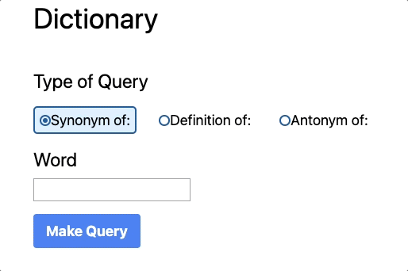
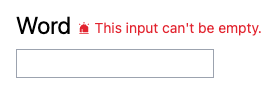
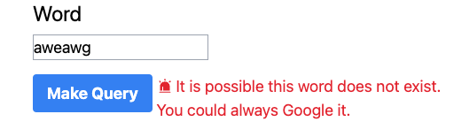

# Dictionary

This project uses [Free Dictionary API](https://dictionaryapi.dev/) from [meetDeveloper](https://github.com/meetDeveloper).

You can view and [use the app on the github pages link](https://dl-little.github.io/dictionary/).

## Considerations Towards Accessibility

The UI for the form follows the example of [W3.org's Radio Group Example Using aria-activedescendant](https://www.w3.org/WAI/ARIA/apg/patterns/radio/examples/radio-activedescendant/). When the radio group is focused, using the arrow keys allows the user to select which radio item is checked. Keydown events synchronize the aria-checked attribute on radio items, as well as the aria-activedescendant attribute on the radio group. This "enables assistive technologies to know which element the application regards as focused while DOM focus remains on the radio group element." (w3).

I also followed accessibility recommendations from this [article about form validation from Sandrina Pereira](https://www.smashingmagazine.com/2023/02/guide-accessible-form-validation/#afterward-validation). When the user is first tabbing through the fields of the form, the empty required field will not trigger a validation error. Once the user makes an update to this field, if it is then left blank, the validation error triggers:

Additionally, every error state is communicated with text, color, and an icon:

## REST Requests

To prevent spamming the free api, many considerations are taken to ensure the form is only submitted when a new word is requested. The response of successful calls to the API are stored in local storage. This way, if a word is requested again, we can spare a request to the server by grabbing the result from local storage instead.

# React + TypeScript + Vite

This template provides a minimal setup to get React working in Vite with HMR and some ESLint rules.

Currently, two official plugins are available:

- [@vitejs/plugin-react](https://github.com/vitejs/vite-plugin-react/blob/main/packages/plugin-react/README.md) uses [Babel](https://babeljs.io/) for Fast Refresh
- [@vitejs/plugin-react-swc](https://github.com/vitejs/vite-plugin-react-swc) uses [SWC](https://swc.rs/) for Fast Refresh
