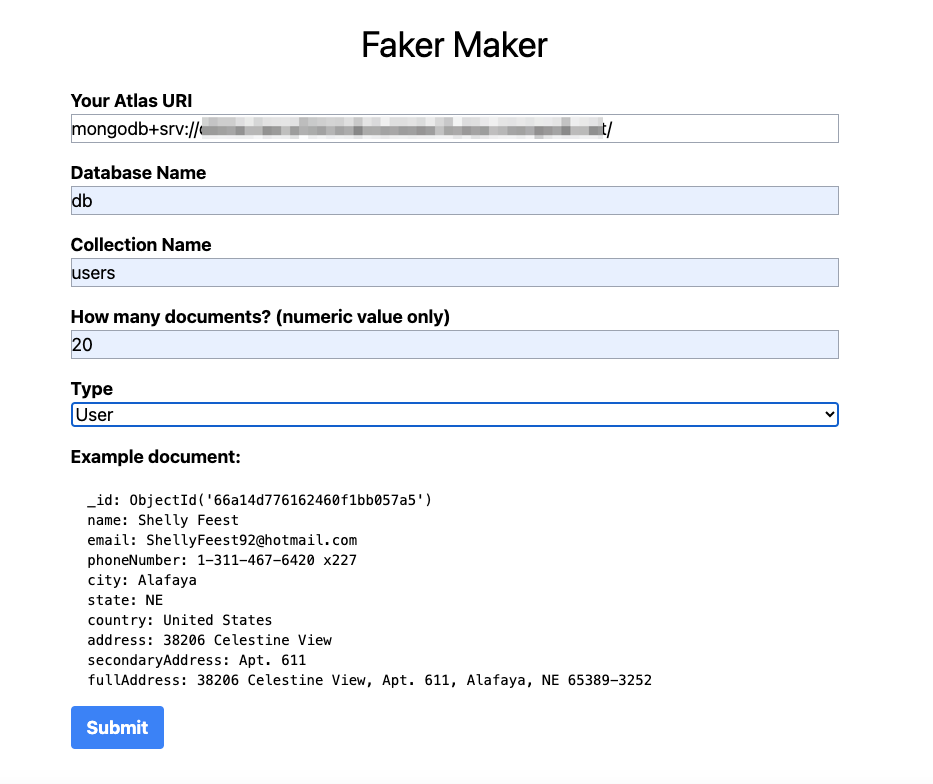

# Create Fake Data in MongoDB cluster for local development

This MERN stack app allows you to easily create fake data in your MongoDB cluster using [FakerJS](https://fakerjs.dev/api/):


The app can make the following document types:

- Product
- User
- Employee
- Credit Card
- Bank Account

## How To

Create a dot env file in the root directory. Here you can set two variables, both prefixed with `VITE_`: `ATLAS_URI` and `EXPRESS_PORT`. If you set the URI here, the app will use this value as the default for the URI field in the form. The port default is 5050 if not set in the dot env file.

Create a dot env file in server directory. Here you can set the environment variable `PORT`. If you do not set this, the default is 5050.

To start the development server:

```bash
npm install && npm run dev
```

To start the express backend server, cd into the server directory and run:

```bash
npm install && npm run start
```

The console should show `Server listening on port 5050`.

Open up the localhost address for the front end app and fill out the fields. As you select the type, you'll see an example of the type of document you will create. Then submit and check in your MongoDB cluster and see that you now have faked data.

# React + TypeScript + Vite

This template provides a minimal setup to get React working in Vite with HMR and some ESLint rules.

Currently, two official plugins are available:

- [@vitejs/plugin-react](https://github.com/vitejs/vite-plugin-react/blob/main/packages/plugin-react/README.md) uses [Babel](https://babeljs.io/) for Fast Refresh
- [@vitejs/plugin-react-swc](https://github.com/vitejs/vite-plugin-react-swc) uses [SWC](https://swc.rs/) for Fast Refresh
